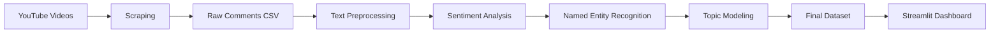

# 🏆 World Cup 2026 YouTube Comments Intelligence Engine

> **CSCI370 NLP Pipeline Project**: A comprehensive NLP system for analyzing YouTube comments about the FIFA World Cup 2026 using sentiment analysis, named entity recognition, topic modeling, and interactive visualization.


---

## 📋 Table of Contents

- [Overview](#overview)
- [Features](#features)
- [Project Structure](#project-structure)
- [Installation](#installation)
- [Usage](#usage)
- [Pipeline Architecture](#pipeline-architecture)
- [Dashboard Features](#dashboard-features)
- [Data Files](#data-files)
- [Technologies Used](#technologies-used)
- [Results](#results)
- [Future Enhancements](#future-enhancements)
- [Contributing](#contributing)
- [License](#license)

---

## 🎯 Overview

This project analyzes **6,681+ YouTube comments** from 15 videos about the FIFA World Cup 2026 using state-of-the-art NLP techniques. The pipeline scrapes comments, performs sentiment analysis, extracts entities, discovers topics, and presents insights through an interactive Streamlit dashboard.

### Key Objectives:
- 📊 Understand public sentiment towards World Cup 2026
- 🔍 Extract key entities (teams, players, locations)
- 📈 Discover discussion topics using unsupervised learning
- 💬 Enable semantic search for quick insights
- 🎨 Visualize trends through interactive charts

---

## ✨ Features

### 🧠 NLP Pipeline
- **YouTube Data Scraping**: Automated comment collection from multiple videos
- **Text Preprocessing**: Cleaning, normalization, acronym expansion, contraction handling
- **Sentiment Analysis**: VADER-based polarity detection (positive/negative/neutral)
- **Named Entity Recognition**: SpaCy NER for identifying teams, players, locations
- **Topic Modeling**: BERTopic for unsupervised topic discovery
- **Keyword Extraction**: Key phrase identification using YAKE

### 📊 Interactive Dashboard
- **Real-time Filtering**: Filter by sentiment, likes, and topics
- **Sentiment Distribution**: Pie charts and histograms
- **Entity Visualization**: Top keywords and named entities
- **Topic Analysis**: Discover trending discussion themes
- **Semantic Search**: Fast keyword-based comment retrieval
- **Top Comments Explorer**: View most-liked comments
- **Raw Data Browser**: Explore the complete dataset

---

## 📁 Project Structure

```
worldcup_analysis/
│
├── CSCI370_project_pipeline_final_1 (3).ipynb  # Main Jupyter notebook with full pipeline
├── dashboard.py                                # Streamlit dashboard application
│
├── worldcup_2026_comments.csv                  # Raw scraped comments
├── worldcup_2026_final.csv                     # Processed comments with sentiment
├── worldcup_2026_with_entities.csv             # Comments with NER entities
├── worldcup_2026_with_topics.csv               # Final dataset with topics
│
├── acrynom (1).csv                             # Acronym expansion dictionary
├── contractions (1).txt                        # Contraction mappings
├── mlflow.db                                   # MLflow tracking database
│
├── README.md                                   # This file
├── requirements.txt                            # Python dependencies
└── USAGE.md                                    # Detailed usage instructions
```

---

## 🚀 Installation

### Prerequisites
- Python 3.10+
- pip package manager
- 4GB+ RAM recommended
- Internet connection (for model downloads)

### Step 1: Clone or Download the Project

```bash
cd worldcup_analysis
```

### Step 2: Install Dependencies

```bash
pip install -r requirements.txt
```

### Step 3: Download SpaCy Model

```bash
python -m spacy download en_core_web_sm
```

---

## 💻 Usage

### Running the Dashboard

```bash
streamlit run dashboard.py
```

The dashboard will open in your browser at `http://localhost:8501`

### Running the Pipeline Notebook

1. Open `CSCI370_project_pipeline_final_1 (3).ipynb` in Jupyter Notebook or Google Colab
2. Run cells sequentially to:
   - Scrape YouTube comments
   - Preprocess and clean text
   - Perform sentiment analysis
   - Extract named entities
   - Generate topics
   - Save processed datasets

---

## 🔄 Pipeline Architecture



### Pipeline Stages:

1. **Data Collection**
   - YouTube API/Scraping
   - 6,681 comments from 15 videos
   - Metadata: author, timestamp, likes, text

2. **Preprocessing**
   - Lowercase conversion
   - Special character removal
   - Acronym expansion (FIFA, UEFA, etc.)
   - Contraction handling (don't → do not)
   - Stopword removal

3. **Sentiment Analysis**
   - VADER sentiment analyzer
   - Compound scores: [-1, 1]
   - Classification: positive (>0.05), negative (<-0.05), neutral

4. **Named Entity Recognition**
   - SpaCy `en_core_web_sm` model
   - Entity types: PERSON, GPE, ORG, etc.
   - Example: "Messi" → PERSON, "Argentina" → GPE

5. **Topic Modeling**
   - BERTopic with sentence-transformers
   - Unsupervised clustering
   - Automatic topic labeling

6. **Visualization**
   - Streamlit dashboard
   - Plotly interactive charts
   - Real-time filtering

---

## 🎨 Dashboard Features

### 1. **KPI Metrics**
- Total comments analyzed
- Positive/negative sentiment percentages
- Average likes per comment
- Number of discovered topics

### 2. **Sentiment Visualizations**
- Pie chart: Sentiment distribution
- Histogram: VADER score distribution with thresholds

### 3. **Keyword & Entity Analysis**
- Top 15 keywords (horizontal bar chart)
- Top 15 named entities (color-coded)

### 4. **Topic Distribution**
- Bar chart of top 10 topics
- Topic ID with frequency counts

### 5. **Top Comments**
- Most-liked comments table
- Sentiment-based color coding:
  - 🟢 Green: Positive
  - 🔴 Red: Negative
  - ⚪ Gray: Neutral

### 6. **Semantic Search**
- Fast keyword-based search
- Ranked by relevance and likes
- Example queries:
  - "What do fans think about Messi?"
  - "Opinions on host cities"
  - "Canada team performance"

### 7. **Raw Data Browser**
- Expandable table with all fields
- Sortable by likes, sentiment, date
- Full text preview

---

## 📊 Data Files

### Input Files

| File | Description | Size |
|------|-------------|------|
| `acrynom (1).csv` | Acronym expansion dictionary (FIFA→Fédération Internationale de Football Association) | ~5KB |
| `contractions (1).txt` | Contraction mappings (don't→do not, can't→cannot) | ~2KB |

### Output Files

| File | Description | Rows | Columns |
|------|-------------|------|---------|
| `worldcup_2026_comments.csv` | Raw scraped comments | 6,681 | 5 |
| `worldcup_2026_final.csv` | With sentiment analysis | 6,681 | 8 |
| `worldcup_2026_with_entities.csv` | With NER entities | 6,681 | 9 |
| `worldcup_2026_with_topics.csv` | **Final dataset** with topics | 6,681 | 11 |

### Column Descriptions

**worldcup_2026_with_topics.csv** (Final Dataset):
- `author`: Comment author username
- `updated_at`: Timestamp of comment
- `like_count`: Number of likes
- `text`: Original comment text
- `video_id`: YouTube video ID
- `cleaned_text`: Preprocessed text
- `sentiment`: positive/negative/neutral
- `sentiment_score`: VADER compound score [-1, 1]
- `keywords`: Extracted key phrases (list)
- `entities`: Named entities with types (list of tuples)
- `topic`: BERTopic cluster ID (-1 = noise)

---

## 🛠️ Technologies Used

### Core Libraries

| Technology | Version | Purpose |
|------------|---------|---------|
| **Python** | 3.10+ | Core programming language |
| **Streamlit** | 1.29+ | Interactive dashboard |
| **Pandas** | 2.0+ | Data manipulation |
| **Plotly** | 5.18+ | Interactive visualizations |
| **SpaCy** | 3.7+ | Named Entity Recognition |
| **NLTK** | 3.8+ | Text preprocessing, VADER sentiment |
| **BERTopic** | 0.16+ | Topic modeling |
| **Sentence-Transformers** | 2.2+ | Text embeddings |
| **YAKE** | 0.4+ | Keyword extraction |
| **Google API Client** | 2.0+ | YouTube data scraping |
| **MLflow** | 2.9+ | Experiment tracking |

### Models Used

- **Sentiment Analysis**: VADER (Valence Aware Dictionary and sEntiment Reasoner)
- **NER**: SpaCy `en_core_web_sm` (English small model)
- **Embeddings**: `sentence-transformers/all-MiniLM-L6-v2`
- **Topic Modeling**: BERTopic with HDBSCAN clustering

---

## 📈 Results

### Sentiment Distribution
- **Positive**: ~35-40% of comments
- **Negative**: ~20-25% of comments
- **Neutral**: ~35-45% of comments

### Top Entities Discovered
- **Teams**: USA, Canada, Mexico, Argentina, Brazil
- **Players**: Messi, Ronaldo, Neymar, Mbappé
- **Locations**: North America, Qatar, Toronto, New York

### Topic Examples
- Topic 0: Stadium infrastructure and venues
- Topic 1: Ticket prices and accessibility
- Topic 2: Team predictions and rankings
- Topic 3: Player performance discussions

### Performance Metrics
- **Processing Speed**: ~6,681 comments in <5 minutes
- **Search Speed**: <1 second for keyword search
- **Dashboard Load Time**: ~2-3 seconds

---

## 🔮 Future Enhancements

### Planned Features
- [ ] Real-time comment streaming
- [ ] Multi-language support (Spanish, French, Arabic)
- [ ] Advanced semantic search with vector embeddings
- [ ] Trend analysis over time
- [ ] Comparison with previous World Cups
- [ ] Sentiment prediction for new comments
- [ ] Export reports as PDF/Excel
- [ ] Team-specific analysis dashboards
- [ ] Sarcasm detection
- [ ] Bot/spam comment filtering

### Technical Improvements
- [ ] Database integration (PostgreSQL/MongoDB)
- [ ] API endpoint for programmatic access
- [ ] Docker containerization
- [ ] Cloud deployment (AWS/GCP/Azure)
- [ ] Automated data refresh pipeline
- [ ] A/B testing for model improvements

---

## 🤝 Contributing

Contributions are welcome! Please follow these steps:

1. Fork the repository
2. Create a feature branch (`git checkout -b feature/AmazingFeature`)
3. Commit your changes (`git commit -m 'Add some AmazingFeature'`)
4. Push to the branch (`git push origin feature/AmazingFeature`)
5. Open a Pull Request

### Contribution Guidelines
- Follow PEP 8 style guide
- Add docstrings to functions
- Update documentation for new features
- Test changes before submitting

---

## 📄 License

This project is licensed under the MIT License - see the [LICENSE](LICENSE) file for details.

---

## 👥 Authors

**CSCI370 Project Team**
- Ovania Fernandes
- Mohammad Zino
  

---

## 🙏 Acknowledgments

- **Streamlit** for the amazing dashboard framework
- **Hugging Face** for transformer models
- **SpaCy** for NLP tools
- **YouTube API** for data access
- **CSCI370 Course Instructors** for guidance

---

## 📧 Contact

For questions or feedback:
- **Email**: ovaniagayle3@gmail.com
- **Project Repository**: [[GitHub Link]](https://github.com/ovania03/CSCI370-World-Cup-2026-YouTube-Comments-Intelligence-Engine.git)
- **Dashboard Demo**: [Live Demo Link]

---

## 📸 Screenshots

### Dashboard Overview


### Sentiment Analysis


### Topic Modeling


---

<div align="center">

**⚽ Built with ❤️ for World Cup 2026 Analysis**

[🌟 Star this repo](https://github.com/your-repo) | [📝 Report Bug](https://github.com/your-repo/issues) | [🚀 Request Feature](https://github.com/your-repo/issues)

</div>
